# Taxi Route Optimization using Genetic Algorithm

**Biologically Inspired Artificial Intelligence - University Project**

## Overview
This project implements a Genetic Algorithm (GA) to solve the classic Reinforcement Learning "Taxi" environment (`Taxi-v4`) from OpenAI's Gymnasium. The goal of the project is to train an AI agent to navigate a grid, successfully pick up a passenger, and drop them off at their destination by evolving an optimal set of instructions over multiple generations.

## How it Works
Instead of using a traditional Neural Network or Q-Learning, this project uses a **Direct Policy Search** via an Evolutionary Lookup Table.
- **State Space:** The Taxi environment has exactly 500 discrete states (representing taxi location, passenger location, and destination).
- **Action Space:** The agent can take 6 possible actions (Move South, North, East, West, Pickup, Dropoff).
- **The Chromosome:** Each potential solution in our genetic population is represented as an array of 500 integers (ranging from 0 to 5). The index represents the state, and the value represents the action.
- **Evolution:** Using **PyGAD**, we evaluate the fitness of these policy arrays based on the total reward accumulated during an episode. The best-performing policies are selected, crossed over, and mutated to create increasingly efficient generations.

## Tech Stack
* **Python 3**
* **PyGAD** - Handles the Genetic Algorithm mechanics (Selection, Crossover, Mutation).
* **Gymnasium** - Provides the `Taxi-v4` simulation environment.
* **Matplotlib** - Used to visualize the fitness improvements across generations.

## Installation & Setup

1. **Clone the repository:**
   git clone https://github.com/Batannn/Taxi-Genetic-Algorithm.git
   cd Taxi-Genetic-Algorithm

2. **Set up the environment:**
   If you are using PyCharm, open the cloned folder and let PyCharm automatically create the virtual environment. Then, open the terminal at the bottom and run:
   pip install gymnasium[toy-text] pygad matplotlib

## Usage
*(Instructions on how to run the training script will be added here once development is complete)*
python main.py

## Flowchart

```mermaid    
   flowchart TD
    Start([Start]) --> Init[Initialize constants:<br/>NUM_STATES=500, NUM_ACTIONS=6<br/>ZONE_COORDS, OPPOSITES, seed weights]
    Init --> InitLog[Initialize fitness_log.csv]
    InitLog --> CollectExp[Collect Experience:<br/>3000 random rollouts<br/>record state→action pairs<br/>that led to pickup]
    CollectExp --> SeedPop[Build seeded initial populations<br/>for 4 islands<br/>50% seeded with good moves, 50% random]

    SeedPop --> EpochLoop{For each epoch<br/>1 to EPOCHS}

    EpochLoop -->|epoch = 1| RunIslandsFirst[Run all 4 islands<br/>from seeded population]
    EpochLoop -->|epoch > 1| DiversityCheck[Check population diversity<br/>per island]

    DiversityCheck --> ConvergedQ{Top-5 fitness<br/>spread < 1.0?}
    ConvergedQ -->|Yes| InjectDiv[Replace bottom 40%<br/>with fresh random chromosomes]
    ConvergedQ -->|No| RunIslandsCont[Run all 4 islands<br/>from previous population]
    InjectDiv --> RunIslandsCont

    RunIslandsFirst --> GA[PyGAD Genetic Algorithm<br/>150 generations per island]
    RunIslandsCont --> GA

    GA --> FitnessLoop{For each chromosome<br/>in population}
    FitnessLoop --> GetCurr[Get curriculum for current epoch:<br/>epoch≤2: free explore<br/>epoch≤4: mild guidance<br/>epoch>4: full pressure]
    GetCurr --> SeedSelect{epoch ≤ 2?}
    SeedSelect -->|Yes| Use4[Use 4 seeds<br/>Phase A only]
    SeedSelect -->|No| Use8[Use 8 seeds<br/>Phase A + Phase B]

    Use4 --> RunEp[run_episode:<br/>simulate taxi navigation<br/>apply wall/revisit/backtrack penalties<br/>apply distance shaping<br/>apply pickup/dropoff bonuses]
    Use8 --> RunEp

    RunEp --> WeightedAvg[Weighted average across seeds<br/>using SEED_WEIGHTS]
    WeightedAvg --> FitnessLoop
    FitnessLoop -->|all chromosomes scored| Evolve[PyGAD evolves population:<br/>uniform crossover<br/>random mutation 25%<br/>roulette wheel selection<br/>keep top 1 elite]
    Evolve --> GenDone{150 generations<br/>complete?}
    GenDone -->|No| FitnessLoop
    GenDone -->|Yes| IslandsComplete[All 4 islands<br/>finished this epoch]

    IslandsComplete --> FindBest[Find best chromosome<br/>across all 4 islands]
    FindBest --> RawEval[Re-evaluate best chromosome<br/>on all 8 seeds<br/>raw env reward, no shaping]
    RawEval --> CompareQ{More deliveries than<br/>best-ever, or tie with<br/>better raw score?}
    CompareQ -->|Yes| SaveBest[Save as best_taxi_policy.npy<br/>Update best_deliveries, best_ever_raw]
    CompareQ -->|No| SkipSave[Keep previous best]
    SaveBest --> QuickTest
    SkipSave --> QuickTest[Terminal quick-test:<br/>print raw score per seed<br/>print pickups/deliveries count]

    QuickTest --> UpdateWeights[update_seed_weights:<br/>failed seeds × 1.5<br/>partial seeds × 1.2<br/>solved seeds × 0.8]

    UpdateWeights --> MigrateQ{epoch is even<br/>AND not last epoch?}
    MigrateQ -->|Yes| Migrate[Migrate top 2 chromosomes<br/>between all islands<br/>replace worst performers]
    MigrateQ -->|No| EpochLoop
    Migrate --> EpochLoop

    %% ==========================================
    %% THE FIX: Forcing the End State to the Bottom
    %% ==========================================

    %% 1. Use a thick, elongated arrow for the main exit path
    EpochLoop ====>|all epochs done| FinalTest[Full GUI test run<br/>on seed=42<br/>render taxi visually]

    %% 2. Use invisible links from the bottom of the loop to force FinalTest downwards
    Migrate ~~~~ FinalTest
    MigrateQ ~~~~ FinalTest

    %% 3. Thick arrow to the absolute end
    FinalTest ===> End([End])

    %% ==========================================
    %% STYLING
    %% ==========================================
    style Start fill:#90EE90,stroke:#333,stroke-width:2px,color:#000
    
    %% Changed from Blue/Yellow to High-Contrast Orange
    style GA fill:#ffcc99,stroke:#e67300,stroke-width:2px,color:#000
    style RunEp fill:#ffb366,stroke:#cc5200,stroke-width:2px,color:#000
    style Evolve fill:#ffcc99,stroke:#e67300,stroke-width:2px,color:#000
    
    %% Highlighted End Sequence
    style FinalTest fill:#fce5cd,stroke:#e69138,stroke-width:3px,color:#000
    style End fill:#ff9999,stroke:#cc0000,stroke-width:4px,color:#000
```

<b>Click to expand the Distributed Evolutionary Architecture Flowchart</b>

   

## 📜 License
This project is licensed under the MIT License - see the LICENSE file for details.

## Contributors
* **Batannn**
* **kajaszanska**
